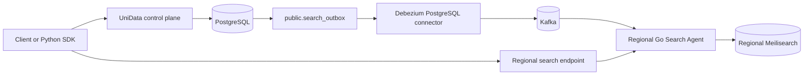

# MeliData

**A CDC-based distributed search platform for centralized writes and regional Meilisearch reads.**

MeliData accepts application documents through a protected API, persists them in PostgreSQL, and uses a transactional outbox, Debezium, and Kafka to distribute changes to regional Meilisearch nodes. Applications write once to the control plane, while users search through a nearby Go Search Agent.

> The supported write path is **UniData -> PostgreSQL -> outbox -> Debezium -> Kafka -> Go Search Agent -> Meilisearch**. Do not write directly to Meilisearch: doing so bypasses the source of truth and makes regional indexes inconsistent.

## Contents

- [Capabilities](#capabilities)
- [Architecture](#architecture)
- [Components](#components)
- [Quick Start](#quick-start)
- [Configuration](#configuration)
- [Using the API](#using-the-api)
- [Python SDK](#python-sdk)
- [CDC Verification and Operations](#cdc-verification-and-operations)
- [Multi-region Deployment](#multi-region-deployment)
- [Development and Tests](#development-and-tests)
- [Security](#security)
- [Troubleshooting](#troubleshooting)
- [Repository Layout](#repository-layout)
- [Contributing](#contributing)
- [License](#license)

## Capabilities

- **One authoritative write path**: documents are tenant-isolated by application and stored in PostgreSQL.
- **Transactional CDC**: a PostgreSQL trigger emits a `public.search_outbox` record in the same database transaction as the document change.
- **Regional search**: each region consumes a complete Kafka stream using a region-specific consumer group and maintains its own Meilisearch index.
- **Application-aware routing**: documents are indexed as `{app_name}_{collection}`; API keys keep applications isolated.
- **Operational control plane**: an Open Platform portal manages applications, API keys, agents, indexes, audit records, and SDK downloads.
- **Python clients**: synchronous and asynchronous SDKs provide document CRUD, index management, Agent discovery, and search.
- **Docker-first local stack**: the root Compose files start PostgreSQL, Kafka, Debezium Connect, UniData, Redis, Meilisearch, and the Go Agent together.

## Architecture



### Write and search flow

1. A client calls `POST /api/v1/data/{collection}` with an application API key.
2. UniData validates the request and writes the document to the tenant-owned PostgreSQL storage.
3. The same transaction writes an operation to `public.search_outbox`.
4. Debezium reads the outbox from PostgreSQL logical replication and publishes it to Kafka.
5. Every region's Go Agent consumes the topic through its own Kafka consumer group and updates its local Meilisearch index.
6. The client searches an Agent using the same API key. The Agent resolves the application namespace and forwards the request to its local Meilisearch.

The outbox is the CDC contract. Tenant schemas may appear in PostgreSQL, but Debezium intentionally captures only `public.search_outbox`, not each tenant table directly. This isolates schema internals from the event protocol and ensures a document write and its search event either commit together or roll back together.

## Components

| Component | Responsibility | Default local endpoint |
| --- | --- | --- |
| `unidata` | FastAPI control plane, Open Platform, document and index APIs | `http://localhost:8080` |
| `postgres` | Source of truth, tenant data, outbox, replication source | `localhost:5432` |
| `connect` | Kafka Connect with Debezium PostgreSQL connector | `http://localhost:8083` |
| `kafka` / `zookeeper` | CDC event transport and coordination | `localhost:9092` / `localhost:2181` |
| `meilisearch-sync` | Kafka consumer, API-key registry, Agent registration, search HTTP API | `http://localhost:8091` |
| `meilisearch` | Local regional search index | `http://localhost:7700` |
| `redis` | Regional Agent API-key registry | `localhost:16379` in development |
| `kafka-ui` | Optional Kafka inspection interface | `http://localhost:8085` |

The first Compose startup also runs short-lived initialization services: `postgres-role-init`, `unidata-migrate`, `postgres-cdc-init`, `kafka-init`, and `connect-init`. They create the required roles, tables, outbox publication, Kafka topics, and Debezium connector.

## Quick Start

### Prerequisites

- Docker Engine with Docker Compose v2
- `curl` and `jq` for the verification commands below
- Python 3.10+ only when using or developing the Python SDK
- Go only when developing the Go Agent outside Docker

### 1. Create deployment configuration

```bash
git clone <your-fork-or-repository-url>
cd pg2meili-cdc
cp .env.docker.example .env.docker
```

Edit `.env.docker` before starting. At minimum, replace every `replace-with-...` value, including database passwords, `OPEN_PLATFORM_SESSION_SECRET`, `AGENT_REGISTRATION_TOKEN`, and `MEILI_MASTER_KEY`. Set `AGENT_IP` to an address that the UniData container can use to reach the Agent.

Create a password hash for the Open Platform administrator:

```bash
docker compose --env-file .env.docker run --rm unidata \
  python scripts/hash_admin_password.py
```

Put the output in `OPEN_PLATFORM_ADMIN_PASSWORD_HASH`. Because Argon2 hashes contain `$`, wrap the full value in single quotes in `.env.docker`.

### 2. Start the complete local stack

```bash
docker compose --env-file .env.docker up -d --build --wait
docker compose --env-file .env.docker ps
```

The first build downloads images and dependencies. `--wait` waits for long-lived services with health checks; the one-time setup containers should show `exited (0)`.

For production-style local port binding, use the override file:

```bash
docker compose --env-file .env.docker \
  -f docker-compose.yml \
  -f docker-compose.prod.yml \
  up -d --build --wait
```

`docker-compose.prod.yml` binds data-plane ports to `127.0.0.1` and does not publish Redis. Put a TLS reverse proxy in front of the public UniData and Agent endpoints.

### 3. Confirm service readiness

```bash
curl -fsS http://localhost:8080/health | jq
curl -fsS http://localhost:8080/ready | jq
curl -fsS http://localhost:8091/health | jq
curl -fsS http://localhost:7700/health | jq
```

Useful local entry points:

- OpenAPI: `http://localhost:8080/docs`
- Open Platform: `http://localhost:8080/open-platform/`
- Kafka UI, when enabled: `http://localhost:8085`

Enable Kafka UI only for diagnostics:

```bash
docker compose --env-file .env.docker --profile debug up -d kafka-ui
```

## Configuration

Copy `.env.docker.example` rather than creating configuration from scratch. The important settings are below. Keep actual `.env` and `.env.docker` files out of source control.

| Variable | Purpose |
| --- | --- |
| `PG_CONN_STRING` | UniData connection string, normally using `unidata_app` and the internal `postgres:5432` host |
| `UNIDATA_PG_USER` / `UNIDATA_PG_PASSWORD` | Least-privilege role used by the application for writes and tenant DDL |
| `CDC_PG_USER` / `CDC_PG_PASSWORD` | Debezium logical-replication role, including the access needed for outbox snapshots |
| `MEILI_MASTER_KEY` | Meilisearch master key; the Agent uses it internally as `MEILI_API_KEY` when no separate key is provided |
| `AGENT_REGISTRATION_TOKEN` | Shared secret used only when an Agent registers or confirms cleanup with UniData |
| `AGENT_IP` | Agent address visible to the central UniData service |
| `AGENT_PUBLIC_URL` | Optional stable, externally reachable Agent URL advertised to SDK clients through Agent discovery |
| `KAFKA_EXTERNAL_HOST` | Kafka host or DNS name reachable by a remote regional Agent |
| `CDC_TABLE_INCLUDE_LIST` | Debezium table filter. Keep the default `public.search_outbox` for the supported outbox protocol |
| `CDC_SLOT_NAME` / `CDC_PUBLICATION_NAME` | PostgreSQL logical-replication slot and publication names |
| `OPEN_PLATFORM_COOKIE_SECURE` | Set to `true` behind HTTPS in production |
| `CORS_ALLOW_ORIGINS` | Explicit origins allowed to call the control plane from browsers |

Do not reuse the PostgreSQL superuser for application traffic, use a public Meilisearch master key in clients, or expose Kafka, Connect, PostgreSQL, Redis, or Meilisearch directly to the Internet.

## Using the API

All data, index, Agent-discovery, and Agent-search calls use Bearer authentication:

```http
Authorization: Bearer <MELIDATA_API_KEY>
```

Create applications and API keys from the Open Platform. API keys are shown only at creation or rotation time; store them in a secret manager.

### Scopes

| Scope | Allows |
| --- | --- |
| `data:read` | Get/list documents and list indexes |
| `data:write` | Upsert/delete documents, delete indexes, and update index settings |
| `search:read` | Discover online Agents and execute searches |

### Control-plane endpoints

| Method | Endpoint | Required scope |
| --- | --- | --- |
| `POST` | `/api/v1/data/{collection}` | `data:write` |
| `POST` | `/api/v1/data/{collection}/batch` | `data:write` |
| `GET` | `/api/v1/data/{collection}` | `data:read` |
| `GET` | `/api/v1/data/{collection}/{id}` | `data:read` |
| `DELETE` | `/api/v1/data/{collection}/{id}` | `data:write` |
| `GET` | `/api/v1/indexes` | `data:read` |
| `DELETE` | `/api/v1/indexes/{collection}` | `data:write` |
| `POST` | `/api/v1/indexes/{collection}/settings` | `data:write` |
| `GET` | `/api/v1/agents/online?region={region}` | `search:read` |

Collection names must match `[A-Za-z0-9][A-Za-z0-9_-]{0,127}`. A document must include a non-empty string `id`; its other fields are application-defined.

### Write a document

Use the control-plane base URL. The request body is the document itself, not a nested `payload` wrapper.

```bash
BASE_URL=http://localhost:8080
API_KEY=replace-with-an-application-api-key

curl --fail-with-body -X POST "$BASE_URL/api/v1/data/products" \
  -H "Authorization: Bearer $API_KEY" \
  -H 'Content-Type: application/json' \
  -d '{
    "id": "sku-001",
    "name": "Mechanical Keyboard",
    "price": 699,
    "status": "active"
  }'
```

The response acknowledges the source-of-truth write. Search becomes available after the asynchronous CDC pipeline reaches the Agent's Meilisearch instance.

### Search a local Agent

The internal Go Agent route is:

```text
POST /api/v1/collections/{collection}/search
```

For a local Compose stack, call it directly:

```bash
curl --fail-with-body -X POST \
  "http://localhost:8091/api/v1/collections/products/search" \
  -H "Authorization: Bearer $API_KEY" \
  -H 'Content-Type: application/json' \
  -d '{"q": "keyboard", "limit": 10}'
```

For the public deployment, the reverse proxy exposes the Agent below `/documents`; therefore use this route instead:

```bash
BASE_URL=https://meilisearch.1oa.com.cn
SEARCH_URL=https://meilisearch.1oa.com.cn/documents

curl --fail-with-body -X POST \
  "$SEARCH_URL/api/v1/collections/products/search" \
  -H "Authorization: Bearer $API_KEY" \
  -H 'Content-Type: application/json' \
  -d '{"q": "keyboard", "limit": 10}'
```

The `/documents` prefix belongs to the public reverse proxy. It is not part of the Go Agent's internal route and must not be added when calling `http://localhost:8091` directly. The legacy `/sync` public path is not a supported search base.

## Python SDK

Install the published package:

```bash
pip install melidata-sdk
```

Or install the checked-out SDK while developing this repository:

```bash
pip install ./python-sdk
```

Python 3.10 or newer is required. `MeliDataClient` and `AsyncMeliDataClient` support document CRUD, batch writes, index management, Agent discovery, retries, error mapping, and Meilisearch search parameters.

```python
import os

from melidata_sdk import MeliDataClient

BASE_URL = "https://meilisearch.1oa.com.cn"
SEARCH_URL = "https://meilisearch.1oa.com.cn/documents"

with MeliDataClient(
    BASE_URL,
    os.environ["MELIDATA_API_KEY"],
    search_url=SEARCH_URL,
) as client:
    client.upsert_document(
        "products",
        {"id": "sku-001", "name": "Mechanical Keyboard", "price": 699},
    )

    result = client.search("products", query="keyboard", limit=10)
    for hit in result.hits:
        print(hit["id"], hit.get("name"))
```

When `search_url` is omitted, the SDK queries `/api/v1/agents/online`, filters by `region` when provided, and selects a registered Agent. Use a fixed `search_url` when the application should always use a known reverse-proxied endpoint.

See [python-sdk/README.md](python-sdk/README.md) for async usage, retry semantics, custom `httpx` clients, generic requests, and all supported search arguments.

## CDC Verification and Operations

### Verify the Debezium connector

`connect-init` registers the connector during stack startup. It is required for every document write to reach Kafka and Meilisearch.

```bash
connector_name=$(awk -F= '$1 == "CDC_CONNECTOR_NAME" { name = $2 } END { print name }' .env.docker)
connector_name=${connector_name:-pg-search-outbox-connector}

curl -fsS "http://localhost:8083/connectors/$connector_name/status" | jq
```

The connector and its tasks should report `RUNNING`. If the configuration changed, rerun its initializer after confirming PostgreSQL and Kafka are healthy:

```bash
docker compose --env-file .env.docker up -d connect-init
docker compose --env-file .env.docker logs --tail=200 connect-init connect
```

Do not solve a CDC failure by sending documents directly to Meilisearch. Repair the connector, replication configuration, permissions, or consumer instead; direct writes merely mask lost propagation.

### Watch the chain

```bash
# Current service status
docker compose --env-file .env.docker ps

# UniData writes and outbox activity
docker compose --env-file .env.docker logs -f unidata

# Debezium connector logs
docker compose --env-file .env.docker logs -f connect

# Kafka consumer, index updates, Agent registration, and search API logs
docker compose --env-file .env.docker logs -f meilisearch-sync

# Directly inspect the local Go Agent health
curl -fsS http://localhost:8091/health | jq
```

To inspect the outbox inside the local PostgreSQL container:

```bash
docker compose --env-file .env.docker exec postgres \
  sh -c 'psql -U "$POSTGRES_USER" -d "$POSTGRES_DB" \
    -c "SELECT event_version, collection, document_id, operation FROM public.search_outbox ORDER BY event_version DESC LIMIT 20;"'
```

The command expands `POSTGRES_USER` and `POSTGRES_DB` inside the PostgreSQL container, so it uses the values supplied by `.env.docker` without exposing them in the host shell.

### Expected consistency behavior

The control-plane write is committed synchronously. Search indexing is asynchronous and eventually consistent: a successful document response means PostgreSQL and its outbox event committed, not that every region has finished indexing. Design read-after-write workflows to poll search briefly or read the document from UniData when strict immediacy is required.

Kafka preserves per-partition order, and the outbox has a monotonic `event_version` used by the Agent to reject stale updates. Each region must keep an independent consumer group so every region receives the complete event stream.

## Multi-region Deployment

The root Compose stack is appropriate for a complete central environment and local integration testing. A remote search region normally needs only the Go Agent, a regional Meilisearch, and Redis, plus network access to the central Kafka broker and UniData registration endpoint. It does not run a second PostgreSQL, Debezium, Kafka Connect, or UniData control plane.

For each region:

1. Deploy Meilisearch, Redis, and `meilisearch-sync-service`.
2. Give the region a unique `REGION_ID`, such as `beijing` or `shanghai`.
3. Use the same `REGION_ID` for replicas in the *same* region.
4. Set `KAFKA_BROKERS` to the central Kafka endpoint reachable from that region.
5. Configure `AGENT_PUBLIC_URL` with the HTTPS URL clients can reach, and configure the matching registration token.
6. Protect the public Agent endpoint with TLS and expose only the search and health routes required by your reverse proxy.

The consumer group is derived as `{KAFKA_GROUP_PREFIX}-{REGION_ID}`. Regions must not share a group: Kafka would split partitions between them, so each regional Meilisearch would receive only part of the data. A newly created group may need a Debezium snapshot or explicit full reindex to restore historical documents beyond Kafka retention.

## Development and Tests

### Backend

```bash
cd UniData
uv venv
uv sync
uv run pytest
```

Run the service outside Docker only after configuring its database, Kafka, Redis, and agent settings:

```bash
cd UniData
uv run python main.py
```

### Go Agent

```bash
cd meilisearch-sync-service
go test ./...
go run main.go
```

### Open Platform frontend

```bash
cd open-platform-web
npm install
npm test
npm run build
npm run dev
```

The development server defaults to `http://127.0.0.1:3100/open-platform/` and proxies API requests to UniData. In production, UniData serves the built frontend; do not deploy a competing static frontend container.

### Python SDK

```bash
cd python-sdk
python -m pytest
```

The real-stack integration test is intentionally opt-in because it writes data through the actual CDC chain and waits for Meilisearch indexing:

```bash
MELIDATA_LOCAL_STACK=1 pytest tests/test_local_stack_integration.py
```

Before running that test, start the root Docker stack and create an API key with the required data and search scopes. The integration suite must not be changed to bypass CDC; a direct Meilisearch write does not validate the system's data path.

### Compose watch mode

During backend development, Compose can synchronize Python source changes and restart UniData:

```bash
docker compose --env-file .env.docker watch unidata
```

Dependency, SDK, Dockerfile, and frontend changes trigger a rebuild; files under `UniData/app` are synchronized and restarted.

## Security

- Keep `.env.docker`, local `.env` files, API keys, passwords, and session secrets outside Git. The repository example contains placeholders only.
- Use a secret manager or Docker secrets for production. UniData supports selected `*_FILE` secret settings.
- Put UniData and public Agent endpoints behind HTTPS. Set `OPEN_PLATFORM_COOKIE_SECURE=true` when TLS terminates in front of the service.
- Restrict `CORS_ALLOW_ORIGINS` to real browser origins; do not use an unrestricted production policy.
- Keep database, Kafka, Kafka Connect, Redis, and Meilisearch private. `docker-compose.prod.yml` is designed for this boundary.
- Use API-key scopes minimally and rotate/revoke keys through the Open Platform. Do not place a Meilisearch master key in SDK code or browser applications.
- The Agent registration token is an operations credential, not a client credential. Never send it with normal document or search requests.

## Troubleshooting

| Symptom | Check | Likely correction |
| --- | --- | --- |
| Write succeeds but search returns no hits | `search_outbox`, connector status, `connect` and `meilisearch-sync` logs | Restore CDC/consumer health and wait for indexing; do not write directly to Meilisearch |
| Search says collection does not exist | Confirm the write's `app_name` and collection, then wait for CDC | The target index is `{app_name}_{collection}` and is created by the Agent after consuming the event |
| Connector is failed or missing | `curl http://localhost:8083/connectors/<name>/status` | Check `CDC_PG_*`, replication slot/publication settings, PostgreSQL logical WAL, then rerun `connect-init` |
| Remote Agent has partial data | Inspect `REGION_ID` and Kafka group configuration | Assign each region a unique consumer group; reindex or use a snapshot for lost historical events |
| SDK gets a public-domain 404 | Check `search_url` | Use `https://meilisearch.1oa.com.cn/documents`, not the obsolete `/sync` path |
| Local Redis port is occupied | Inspect `REDIS_PORT` | The default host mapping is `16379`; change only the host-side value as needed |
| Agent registration works locally but fails remotely | Check `AGENT_IP`, `AGENT_PUBLIC_URL`, DNS/TLS, and reverse proxy reachability | Configure a reachable stable URL and preserve the internal Agent route behind its public `/documents` prefix |
| `ready` returns 503 | `curl http://localhost:8080/ready | jq` | Use the reported readiness checks to repair its dependency rather than restarting unrelated services blindly |

For more detailed service-specific configuration, consult [UniData/README.md](UniData/README.md), [meilisearch-sync-service/README.md](meilisearch-sync-service/README.md), [python-sdk/README.md](python-sdk/README.md), and [open-platform-web/README.md](open-platform-web/README.md).

## Repository Layout

```text
.
├── UniData/                     # FastAPI control plane, migrations, domain logic, tests
├── meilisearch-sync-service/    # Go CDC consumer and authenticated search Agent
├── open-platform-web/           # React + TypeScript Open Platform frontend
├── python-sdk/                  # melidata-sdk package and tests
├── docker/                      # PostgreSQL, Kafka, and Debezium bootstrap scripts
├── scripts/                     # Deployment verification helpers
├── Dockerfile                   # UniData image; includes the built Open Platform
├── docker-compose.yml           # Complete local/central stack
├── docker-compose.prod.yml      # Production network exposure overrides
└── .env.docker.example          # Safe environment template
```

## Contributing

1. Create a focused branch and keep unrelated formatting or generated-file changes out of it.
2. Update or add tests for behavioral changes. Changes to document writes must preserve the PostgreSQL outbox and CDC path.
3. Run the relevant checks for the area you changed: `uv run pytest`, `go test ./...`, `npm test`, `npm run build`, or the opt-in local-stack integration test.
4. Run `git diff --check` before opening a pull request.
5. Document new configuration, public routes, and operational requirements in the appropriate README.

## License

This repository currently does not include a root `LICENSE` file. Add an explicit license before publishing or accepting external contributions so reuse and contribution terms are unambiguous.
