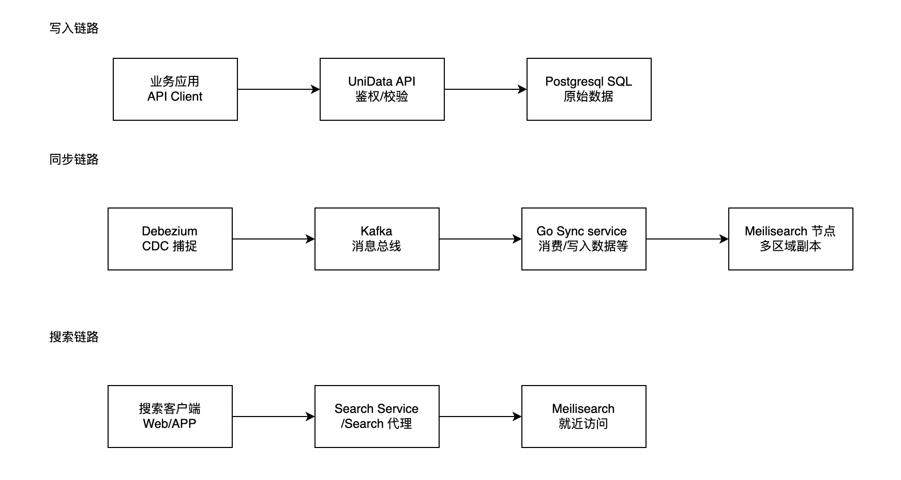

# 部署指南概览

本指南旨在协助运维专家与系统架构师高效构建 UniData 分布式搜索集群。UniData 采用先进的 **云原生同步架构**，确保在复杂的跨地域网络环境下，数据依然能够实现毫秒级的同步与检索。

## 🚀 部署路线图

::: info 建议阅读顺序
为了确保生产环境的稳定性，请务必按照以下步骤进行评估与实施：
:::

| 阶段 | 模块 | 核心内容 |
| :--- | :--- | :--- |
| **01 评估** | [系统需求](/deployment/requirements) | 硬件规格选型、Linux 内核调优、依赖组件清单 |
| **02 实施** | [安装步骤](/deployment/installation) | 容器化部署、服务编排、集群初始化流程 |
| **03 配置** | [配置介绍](/deployment/configuration) | 环境变量映射、性能参数微调、安全策略配置 |
| **04 交付** | [运行和维护](/deployment/operations) | 健康监控、自动化备份、灾备切换指南 |

## 🏗️ 架构愿景：CDC 驱动的全球分发

UniData 的核心价值在于将**写压力**与**读负载**在地理维度上彻底解耦。

### 核心流转逻辑

1.  业务通过统一 API 写入，数据落地中心节点 PostgreSQL。
2.  Debezium 捕获 WAL 变更，将数据库状态转化为无损事件流。  
3.  Kafka 作为高可用消息骨干网，负责跨地域数据分发。
4.  Go Sync Service 在边缘节点实时消费消息并重建索引。
5.  终端用户就近访问 Meilisearch，享受极致响应速度。

## 🛠️ 技术栈蓝图

选择了业界最成熟的开源组件，通过深度定制实现高性能数据链路：

::: details 🗄️ 数据持久层：PostgreSQL
- **定位**: 全局唯一可信数据源 (Single Source of Truth)。
- **黑科技**: 利用 **Logical Replication** 与 `pgoutput` 插件，将关系型数据库转化为实时流式数据源，确保金融级的数据一致性。
:::

::: details 🔄 CDC 引擎：Debezium
- **定位**: 非侵入式变更捕获。
- **黑科技**: 伪装成数据库从节点监听 WAL 日志，业务代码无需任何改动即可实现数据实时外发。
:::

::: details 🛣️ 消息总线：Apache Kafka
- **定位**: 跨地域同步的“中枢神经”。
- **黑科技**: 依靠多分区负载均衡与消费者组机制，支持全球数百个边缘节点的动态接入与故障自愈。
:::

::: details ⚡ 搜索引擎：Meilisearch
- **定位**: 极致轻量的边缘检索单元。
- **黑科技**: 基于 Rust 构建，内存占用极低。其高度优化的索引结构在边缘节点上可提供优于 Elasticsearch 的即时搜索体验。
:::

::: details 🛡️ 业务网关：FastAPI (Python)
- **定位**: 声明式 API 管理。
- **黑科技**: 基于异步 IO 架构，内置强类型校验与 JWT 鉴权，作为系统流量的第一道安全屏障。
:::

::: details 🚀 同步引擎：Go Sync Service
- **定位**: 高并发流处理器。
- **黑科技**: 充分利用 Go 的协程特性，实现极低延迟的消息解析与并发索引写入，是连接云端与边缘的性能保障。
:::

