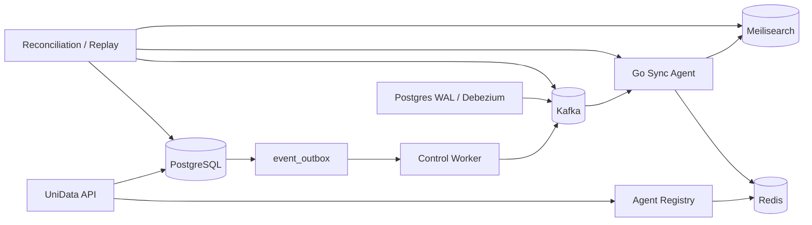

# pg2meili-cdc 系统优化方案

> 评审范围：UniData 主后端、PostgreSQL CDC 流程、开放平台、Go Agent。
> 目标：收敛事件模型，消除多实例重复任务和 CDC 乱序风险，补齐应用删除、权限、安全、对账和运维闭环，并逐步减少无效代码。

## 1. 结论摘要

当前系统可以工作，但核心链路存在四类结构性问题：

1. **事件出口不统一**：`search_outbox`、`open_platform_outbox` 和 Kafka command 直发并存，可靠性、重试和审计逻辑分散。
2. **生命周期与 CDC 没有形成一致性协议**：应用删除、索引配置变更和文档事件之间缺少统一版本门禁，存在乱序覆盖、删除后复活、旧事件重建索引的风险。
3. **Web 进程承担长任务**：FastAPI 生命周期内启动扫描和 outbox 发布任务，多 worker 或多副本部署时会重复执行，且故障恢复边界不清晰。
4. **控制面安全和运维闭环不足**：Agent 注册参数可影响中心侧健康检查，CORS 和限流策略偏宽，Redis 缓存、Kafka、Meilisearch 与 PostgreSQL 之间缺少可执行的对账和恢复工具。

建议采用“**统一 durable event outbox + Kafka 至少一次投递 + Agent 幂等消费 + 应用生命周期状态机 + 独立 Worker + 对账恢复**”作为总体方向。不要一次性重写，按兼容迁移、双写校验、切流、删除旧路径四个阶段推进。

## 2. 目标架构



### 2.1 责任边界

- **UniData API**：鉴权、租户和应用元数据、集合配置、任务创建；不承担持续运行的发布和扫描任务。
- **PostgreSQL**：业务事实、应用生命周期、集合配置版本、事件 outbox；数据库事务内完成业务写入与事件落库。
- **Debezium/Kafka**：传输和缓冲，不承载业务状态判断；Kafka 使用 at-least-once。
- **Control Worker**：outbox 发布、Agent 探活/心跳协调、清理任务、对账任务和 DLQ 重试。
- **Go Agent**：本地索引执行、API Key 缓存、事件幂等和版本门禁；不能自行推断全局业务状态。
- **Meilisearch**：最终索引结果，不作为业务真相源。

## 3. 统一事件模型

### 3.1 统一 `event_outbox`

逐步替换 `search_outbox` 和 `open_platform_outbox`，并禁止新的 Kafka command 直发。建议字段：

| 字段 | 说明 |
| --- | --- |
| `event_id` | UUID，端到端幂等键 |
| `event_type` | 如 `document.upsert`、`document.delete`、`collection.settings.changed`、`application.lifecycle.changed` |
| `aggregate_type` / `aggregate_id` | 事件所属业务聚合 |
| `aggregate_version` | 聚合内单调递增版本 |
| `partition_key` | 通常为 `app_id:collection:document_id` |
| `payload` | 只放业务字段，不重复放内部路由字段 |
| `state` | `pending`、`publishing`、`published`、`dead` |
| `attempts` / `next_attempt_at` | 重试调度 |
| `claimed_by` / `claimed_at` | 多实例 claim 和崩溃恢复 |
| `published_at` / `last_error` | 审计与运维 |

事件外层 envelope 负责携带 `app_id`、`collection`、`document_id`、租户和协议版本；业务 payload 不再重复这些内部路由字段。事件 schema 由 JSON Schema 作为唯一来源，并生成 Python、Go、TypeScript 类型。

### 3.2 发布与重试

发布器使用 `SELECT ... FOR UPDATE SKIP LOCKED` claim 待发布事件，短事务内完成 claim，Kafka 成功后更新为 `published`。进程崩溃时，超过 lease 的 `publishing` 事件可被重新 claim。重试使用指数退避并设置最大次数；超过阈值进入 DLQ/`dead`，保留人工或命令行 replay 能力。

要明确接受“数据库提交成功但 Kafka 尚未发布”的短暂延迟，不能在 API 请求内同步等待 Kafka。

## 4. CDC 与一致性优化

### 4.1 文档版本门禁

为每条文档变更增加单调递增 `revision`，以 `app_id + collection + document_id` 作为幂等作用域。Go Agent 维护本地已处理版本：

- `revision <= last_revision`：确认消息并丢弃，不覆盖新数据。
- `revision > last_revision`：按事件执行，成功后原子更新版本记录。
- 同一 Kafka partition 保证顺序，跨 partition 仍依赖 revision 门禁。
- 重试必须重复安全，Meilisearch 写入和本地版本更新不能产生“版本已推进但索引未写入”的状态。

### 4.2 应用生命周期 epoch

应用删除或重建时生成新的 `lifecycle_epoch`。事件携带 epoch，Agent 只接受当前 epoch 的事件。应用进入 `deleting/deleted` 后：

- API 拒绝新的文档写入和配置变更，统一返回 `409 APP_DELETING`。
- 旧 epoch 的 CDC 事件直接确认并丢弃。
- 删除完成后，迟到的旧事件不得重新创建 index 或文档。
- 应用重建使用新 epoch，避免旧 Kafka 消息污染新资源。

### 4.3 删除语义统一

统一使用 `document.delete` 业务事件表达删除，不再让消费端同时依赖 Debezium `op` 和业务 `is_delete` 两套判断。软删除也转换为明确的 delete 事件；需要保留历史时由 PostgreSQL 审计/历史表承担，而不是把删除语义混入索引同步逻辑。

## 5. 应用和索引删除状态机

当前删除应用属于跨 PostgreSQL、Redis、Kafka、Agent、Meilisearch 的长事务，必须改为可恢复任务。建议状态：

```text
active
  -> deleting
  -> indexes_pending
  -> indexes_done
  -> schema_pending
  -> deleted

任意阶段失败 -> cleanup_failed -> 重试或人工恢复
```

实现要点：

- API 事务只将应用标记为 `deleting`、写入 `lifecycle_epoch`、创建 cleanup task 并返回 task id。
- 每个 collection、region、Meilisearch index 记录清理状态、attempts、最后错误和时间戳。
- 删除 index 时“不存在”视为成功，操作必须幂等。
- Redis key registry、API Key cache、Kafka 相关元数据和 PostgreSQL schema 清理分别记录结果。
- cleanup worker 可从任意中间状态恢复，不能依赖一次请求持续存活。
- 删除完成后再标记 `deleted`，并禁止通过旧 API 或旧事件路径恢复。

## 6. UniData 主后端优化

### 6.1 将持续任务移出 Web 进程

移出 `main.py` lifespan 中的 `scan_agents_loop` 和 `publish_outbox_loop`。新增独立 worker 入口，按职责拆分为：

- `outbox-publisher`：claim、发布、重试、DLQ。
- `lifecycle-cleaner`：应用/集合删除和过期资源清理。
- `reconciler`：周期性对账和修复任务。

开发环境可以保留单进程模式，但生产环境必须显式选择 worker 模式，避免多 worker 重复启动。

### 6.2 权限模型收敛

将散落的 `owner_itcode` 判断演进为 `application_member`：

- `owner`：应用生命周期、成员和密钥管理。
- `editor`：集合配置和数据写入。
- `viewer`：查询和只读配置。

抽取统一的 `authorize_app(identity, app_id, action)`，让 API、开放平台和后台任务共用同一策略。所有越权结果使用稳定错误码，避免调用方依赖中文错误信息。

### 6.3 租户 schema 与 CDC

- 保留 PostgreSQL RLS 和租户上下文，但将 schema 创建、CDC trigger、publication/slot 配置纳入迁移和健康检查。
- 为触发器写入的 outbox 增加协议版本和 revision，避免不同服务各自拼装事件。
- 对 schema/trigger 失败增加可重试任务和告警，不能只在请求日志中记录。

## 7. 开放平台优化

### 7.1 Agent 注册与 SSRF 防护

当前注册允许提交 IP、端口和 `base_url`，而中心侧主动健康检查会形成 SSRF 面。改造为：

- 默认使用 Agent 心跳，中心只请求已验证的 endpoint。
- 拒绝 loopback、link-local、云 metadata 地址、未允许的私网网段和非 HTTP(S) 协议。
- 对 DNS 解析结果再次校验，防止域名解析到受限地址。
- `base_url` 规范化，禁止重定向到未授权 host。
- 生产环境支持静态 allowlist 或 mTLS；注册和心跳都记录审计日志。

### 7.2 API Key

- API Key 只在创建时返回明文，数据库和 Redis 只保存 hash/加密密文。
- Key 使用 scope、状态、过期时间和 revocation version。
- Agent 缓存采用带版本的 pull/push 协议，撤销后有明确的最大生效延迟。
- 增加按 key、应用、IP 的限流，并对登录和管理端点做失败退避。
- 统一 Python SDK、开放平台 API 和 Agent 校验的错误码与 envelope。

### 7.3 CORS 与接口兼容

Go Agent 的 CORS 从 `*` 改为配置 allowlist，并在生产启动时拒绝空配置。旧 `/search?collection=` 仅保留一个版本周期，迁移到带应用边界的接口后删除；兼容层必须记录调用量，避免无限期保留。

## 8. Go Agent 优化

### 8.1 消费处理

- Kafka consumer 明确区分 decode、业务拒绝、临时失败和永久失败。
- 仅在处理成功、已确认的旧版本、或进入 DLQ 后提交 offset；Meilisearch 临时故障不能提交。
- 为 event type 建立 handler registry，避免大 switch 持续膨胀。
- 所有 handler 都执行 tenant/app/epoch/revision 校验。
- 本地 registry 使用原子版本、过期时间和并发安全更新；中心撤销后主动失效缓存。

### 8.2 可观测性

Agent 增加 `/internal/status`，至少暴露：Kafka lag、最近事件版本、最近错误、处理耗时、索引数、registry version、DLQ 数量。日志统一包含 `event_id`、`app_id`、`collection`、`document_id`、`revision` 和 `trace_id`。

### 8.3 测试

补充以下高风险测试：

- 同一文档乱序 upsert/delete，旧事件不得复活文档。
- 应用删除期间迟到 CDC，不能创建 index。
- consumer 在 Meilisearch 成功后、offset 提交前崩溃，重放结果不变。
- registry 撤销传播、过期、并发刷新。
- 多 consumer、多 partition 和重复事件。

## 9. 精简与清理清单

以下项目先做引用分析和运行数据确认，再删除：

| 项目 | 建议 | 条件 |
| --- | --- | --- |
| `search_outbox`、`open_platform_outbox` | 合并到 `event_outbox` | 完成双写校验和切流 |
| 旧 `/search?collection=` | 兼容一个版本周期后删除 | 指标确认调用量为零 |
| `primary_key_field` | 删除或补齐全链路 | 当前若只存不执行，应优先删除 |
| `IndexService.app_name` | 删除未使用参数 | 全局引用确认 |
| `OpenPlatformOutbox.event_type` | 删除重复字段 | 统一 envelope 后 |
| payload 中重复的 `app_name/app_id/collection` | 迁移到 envelope | SDK 与 Agent 同步升级 |
| 旧 `libs/layui` 和静态资源 | 删除 | 构建、路由、模板、运行时引用为零 |

清理原则：每次只删除一个逻辑簇；先加弃用日志和指标，再删代码；删除后跑全量测试、构建和 compose 校验。

## 10. 对账、恢复和运维闭环

### 10.1 对账维度

- PostgreSQL 应用状态 vs Redis Agent registry。
- `CollectionSettings.version` vs Agent 实际执行版本。
- 文档 revision/outbox watermark vs Kafka offset。
- 期望的 index 集合 vs Meilisearch 实际 index。
- API Key 中心状态 vs Agent 本地缓存版本。

### 10.2 运维动作

提供受保护的命令或管理 API：

- `replay event`：按 event id 或时间范围重放。
- `rebuild-index`：从 PostgreSQL 真相源重建指定集合。
- `retry-dlq`：按错误类型或事件范围重试。
- `invalidate-key-cache`：立即让指定应用或 key 的 Agent 缓存失效。
- `cleanup-application`：从中间状态继续清理。

### 10.3 指标与告警

至少增加：outbox backlog、publisher retry/dead、Debezium/Kafka lag、Agent processing latency、CDC 到索引延迟、DLQ 数、应用删除耗时、索引 drift 数、Key cache drift 数。

## 11. 分阶段实施路线

### P0：先消除线上一致性和安全风险

1. 为文档事件增加 `revision`，Go Agent 增加版本门禁和生命周期 epoch 校验。
2. 应用删除改为 `deleting` 状态和异步 cleanup task，删除期间拒绝写入。
3. 修复 Agent 注册 SSRF 风险，Go CORS 改为 allowlist。
4. 明确 Kafka offset 提交条件，补齐乱序、重复、删除复活测试。
5. 修复当前前端测试回归和 `pyproject.toml` 末尾空白，保持基线全绿。

### P1：建立统一控制面

1. 建立 `event_outbox` schema、publisher、claim lease、重试和 DLQ。
2. 将 collection/index 配置更新从 Kafka 直发迁移到 outbox。
3. 将 open platform outbox 和 search outbox 双写，做事件数量、顺序和 payload 校验。
4. 独立部署 outbox publisher、lifecycle cleaner 和 reconciler。
5. 统一 `authorize_app` 和 application member 权限。

### P2：收敛协议和删除冗余

1. 完成旧 outbox 和旧搜索接口切流、观测和删除。
2. 用 JSON Schema/OpenAPI 生成 Python、Go、TypeScript 协议类型。
3. 删除未使用参数、半实现字段、旧静态资源和重复 envelope 字段。
4. 提供 replay、rebuild-index、DLQ retry、cache invalidation。

### P3：性能与工程化

1. 对大表 outbox、审计表和 CDC 历史做分区/归档。
2. 对发布、消费、清理任务做并发度和批量大小压测。
3. 增加故障注入：Kafka 不可用、Meilisearch 超时、Redis 丢失、Agent 重启和网络分区。
4. 建立 schema/API/event protocol 的兼容性检查，纳入 CI。

## 12. 验收标准

- 任意文档的乱序、重复、重试都不会让旧版本覆盖新版本。
- 应用删除期间不会有新数据进入索引；删除任务可重启、可重试、可审计。
- 任意 API 实例扩容后，不会重复启动 publisher、scanner 或 cleanup。
- Kafka、Meilisearch、Redis 任一短时故障恢复后，事件最终可达，失败事件可定位和重放。
- Agent 注册和中心探活无法访问 loopback、metadata 或未允许的内部地址。
- API Key 撤销在约定 SLA 内传播到所有 Agent。
- Go、UniData、前端测试和生产构建通过；compose 配置校验通过。
- 旧接口和冗余代码都有调用量、迁移状态和明确删除日期。

## 13. 主要风险与取舍

- **统一 outbox 会增加迁移复杂度**：采用双写/校验/切流，避免一次性切换造成不可逆数据丢失。
- **版本门禁需要补充数据字段**：优先在 envelope 中增加 revision/epoch，旧事件按兼容规则处理，再逐步升级生产者。
- **独立 Worker 增加部署单元**：换取清晰的故障边界和多副本安全；开发环境保留一体化启动入口。
- **回放和重建可能造成索引压力**：增加限速、租户级并发上限和 dry-run。
- **删除状态机延长“删除完成”的时间**：这是可观测、可恢复和不误删之间必要的取舍，前端应展示 task 状态而不是假设同步完成。

## 14. 建议的第一批实施任务

1. 定义 event envelope、revision、lifecycle epoch 和错误码的协议文档。
2. 为 Agent 实现 revision/epoch 校验，并先用测试固定行为。
3. 新增 application cleanup task 和 `deleting` 拒写保护。
4. 收紧 Agent 注册校验和 CORS 配置。
5. 建立 `event_outbox` 最小表结构和 publisher 原型，先迁移 index settings command。
6. 将基线测试修复到全绿，再开始双写和切流。
