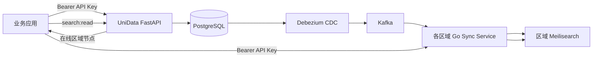

# AI Agent 集成指南落地方案

> 状态：待实施
> 日期：2026-08-10
> 面向对象：为其用户生成 UniData 集成代码的 AI Agent，以及需要人工查看相同资料的开发者。

## 1. 目标与边界

本方案为 UniData 增加一套**只读参考资料**。AI Agent 可通过公开 URL 理解服务的能力、架构、认证、权限、典型接入流程和接口定义，以便为终端用户生成正确的 Python 或 TypeScript 集成代码。

该能力不是 MCP Server、Function Calling 工具或 API 代理，不会让 Agent 直接创建应用、申请密钥、写入数据、搜索数据或调用任何管理接口。实际业务调用仍由用户的应用在获得 API Key 后完成。

第一版范围：

- 运行时集成知识：数据写入、读取、索引、区域节点发现、区域搜索、认证和 SDK。
- 公开、机器可读的 JSON 入口和 Agent 可发现的纯文本入口。
- 开放平台门户中的只读可视化页面。
- 与正在运行的 FastAPI `/openapi.json` 保持一致的公开 REST 操作索引。

第一版不包含：

- Docker Compose、Kafka、Debezium、区域 Sync Service 的部署与运维手册。
- 仓库代码结构、本地开发、贡献流程或二次开发指南。
- 开放平台应用、密钥、审计、用户管理 API 的使用说明。
- `/api/v1/internal/*`、区域节点注册和清理确认等内部协议。
- 任意真实 API Key、地址、用户数据或环境变量值。

## 2. 当前系统事实

### 2.1 调用链



- UniData 数据面 API 统一以 `/api/v1` 为前缀，成功响应为 `{ "data": ..., "message": "ok" }`。
- API Key 属于一个开放平台应用。请求以 `Authorization: Bearer <api_key>` 传递，应用身份用于多租户数据隔离。
- 中心 API 提供文档和索引操作，也提供在线区域节点发现。
- 区域搜索不在 FastAPI OpenAPI 中：客户端先请求 `GET /api/v1/agents/online`，再向返回节点请求 `POST /api/v1/collections/{collection}/search`。
- `open-platform-web` 是独立 Vite 应用，不包含在 UniData Docker 镜像和根 Docker Compose 中；因此机器可读入口必须由 FastAPI 后端提供。

### 2.2 当前权威来源

| 信息 | 权威来源 | Agent Guide 的处理方式 |
| --- | --- | --- |
| HTTP 方法、路径、参数、请求体和响应 schema | FastAPI `/openapi.json` | Guide 只索引并链接，绝不复制完整 schema |
| 公开业务操作集合 | 后端共享 allowlist | Guide 和门户共用同一规则 |
| 认证、scope、调用顺序、区域搜索契约 | 新增 Guide 元数据模块 | 用稳定的人工维护说明补足 OpenAPI 未表达的内容 |
| Python SDK API | `python-sdk` 源码和下载端点 | Guide 链接 SDK，并给出有限的推荐用法 |
| 人类可视化内容 | `open-platform-web` | 读取 `/agent-guide.json` 渲染，不再维护第二份业务事实 |

## 3. 对外契约

### 3.1 `GET /agent-guide.json`

在 `UniData/app/main.py` 注册无需认证的 `GET /agent-guide.json`。该端点调用一个纯构建函数，传入当前 FastAPI 的 OpenAPI 文档和应用元信息，返回 JSON；不得访问数据库、读取用户会话、生成密钥或产生审计事件。响应建议设置 `Cache-Control: public, max-age=300`。

响应固定使用 `schema_version: "1.0"`。服务升级时由 FastAPI 的 `app.version` 填充 `service.version`，无需引入数据库迁移或单独的发布步骤。未知字段必须允许调用方忽略，后续增量字段只能追加。

```json
{
  "schema_version": "1.0",
  "service": {
    "name": "UniData",
    "version": "0.1.0",
    "purpose": "Multi-region document storage and search integration service"
  },
  "usage_policy": {
    "mode": "reference_only",
    "direct_agent_execution": false,
    "instruction": "Use this guide to generate integration code for a user. Do not call service APIs or request credentials on the user's behalf."
  },
  "links": {
    "openapi": "/openapi.json",
    "human_docs": "/docs",
    "llms": "/llms.txt",
    "python_sdk_download": "/api/v1/sdk/python/download"
  },
  "architecture": {
    "write_path": [],
    "search_path": []
  },
  "authentication": {
    "scheme": "Bearer",
    "header": "Authorization",
    "scopes": []
  },
  "workflows": [],
  "operations": [],
  "examples": [],
  "non_targets": []
}
```

字段含义：

| 字段 | 类型 | 规则 |
| --- | --- | --- |
| `service` | object | 返回服务名、运行时 FastAPI 版本和一句用途说明。 |
| `usage_policy` | object | 始终为 `reference_only` 和 `direct_agent_execution: false`，防止消费者将文档误识别为可执行工具定义。 |
| `links` | object | 使用相对路径，便于反向代理、测试环境和任意域名部署。 |
| `architecture` | object | `write_path` 和 `search_path` 为按顺序描述的步骤数组，每步含 `component`、`purpose` 和可选 `endpoint`。 |
| `authentication` | object | 包含请求头模板、三种 scope、scope 的含义和最小授权提醒；不包含 Key 格式中的可用密钥。 |
| `workflows` | array | 固定包含 `write_document`、`read_document`、`configure_index`、`regional_search` 四项；每项包括目标、步骤、required_scopes 和 OpenAPI/区域搜索链接。 |
| `operations` | array | 从当前 OpenAPI 运行时筛选得到，详见第 4 节。 |
| `examples` | array | 固定 Python SDK 和 TypeScript fetch 示例，详见第 5 节。 |
| `non_targets` | array | 明确列出并解释禁止作为业务集成目标的管理、内部和节点运维端点类别。 |

每个 `operations` 元素为：

```json
{
  "operation_id": "upsert_document_api_v1_data__collection__post",
  "method": "POST",
  "path": "/api/v1/data/{collection}",
  "summary": "创建/更新通用文档",
  "description": "向应用隔离的 collection 写入任意 JSON 文档。",
  "required_scopes": ["data:write"],
  "openapi_ref": "/openapi.json#/paths/~1api~1v1~1data~1{collection}/post"
}
```

`operations` 不内嵌 parameters、request body 或 response schema。Agent 需要字段级信息时，必须读取 `openapi_ref`，从而确保信息与当前部署实际接口同步。

### 3.2 `GET /llms.txt`

在 `UniData/app/main.py` 注册公开 `GET /llms.txt`，使用 `PlainTextResponse`，Content-Type 为 `text/plain; charset=utf-8`。内容为稳定、简短的 Markdown 风格文本：

```text
# UniData

UniData is a multi-region document storage and search integration service.
This document is reference-only for AI agents generating user integration code; it is not a tool interface.

## Start here
- Agent integration guide: /agent-guide.json
- REST API schema: /openapi.json
- Human API documentation: /docs
- Python SDK download: /api/v1/sdk/python/download

## Boundaries
Use only the public caller APIs identified by /agent-guide.json. Do not use open-platform administration, internal synchronization, or agent registration endpoints for user integrations.
```

不在 `llms.txt` 中复制 API 清单、参数、示例或部署地址，避免该文件和 Guide/OpenAPI 发生内容漂移。

### 3.3 门户页 `/docs/agent-guide`

在 `open-platform-web` 新增 `AgentGuidePage`，并通过以下入口访问：

- React 路由：`/docs/agent-guide`。
- `DocsLayout` 左侧导航：增加“AI Agent 接入”。
- `SiteLayout` 顶部导航可保持现有三项，不增加额外顶级导航，避免与“API Reference”重复。
- 快速开始页的“继续集成”区域增加指向该页面的普通文档链接。

页面在加载时请求 `/agent-guide.json`，不依赖登录态、不读取 API Key、不展示 API Playground 组件，也不提供“发送请求”按钮。页面结构：

1. 标题与参考用途声明：明确页面供 Agent 和开发者理解服务，不用于直接执行服务操作。
2. 系统调用链：展示中心写入和区域搜索两个流程。
3. 认证与权限：展示 Bearer 请求头与 scope 矩阵。
4. 推荐接入流程：按写入、读取、索引配置、区域搜索分组。
5. 公开能力索引：方法、路径、用途、scope，并链接 API Reference 与 `/openapi.json`。
6. 代码示例：Python SDK 和 TypeScript fetch 各一套。
7. 边界说明：管理、内部同步和区域节点注册不属于业务集成。
8. 加载失败状态：说明 Guide 暂不可用，并保留 `/openapi.json` 与 `/docs` 的可点击链接。

## 4. 公开操作筛选

不要按 FastAPI tag 做宽松筛选。现有前端 `allowedTags` 包含 `agents`，会把 `POST /api/v1/agents/register` 与 `POST /api/v1/agents/cleanup-confirmations` 这类需要 `X-Agent-Token` 的节点运维接口误归类为调用方接口。

在后端 Guide 模块定义单一显式 allowlist。允许的路径及 required scope：

| 路径 | 方法 | Scope | 用途 |
| --- | --- | --- |
| `/api/v1/data/{collection}` | `POST` | `data:write` | 创建或更新一个 JSON 文档。 |
| `/api/v1/data/{collection}/batch` | `POST` | `data:write` | 批量创建或更新文档。 |
| `/api/v1/data/{collection}` | `GET` | `data:read` | 分页读取集合文档。 |
| `/api/v1/data/{collection}/{id}` | `GET` | `data:read` | 读取单个文档。 |
| `/api/v1/data/{collection}/{id}` | `DELETE` | `data:write` | 软删除文档。 |
| `/api/v1/indexes` | `GET` | `data:read` | 获取当前应用使用的集合/索引。 |
| `/api/v1/indexes/{collection}` | `DELETE` | `data:write` | 删除应用内集合索引。 |
| `/api/v1/indexes/{collection}/settings` | `POST` | `data:write` | 配置可筛选和可排序字段。 |
| `/api/v1/agents/online` | `GET` | `search:read` | 获取在线区域搜索节点，可按 `region` 筛选。 |
| `/api/v1/sdk/python/download` | `GET` | 无 | 下载官方 Python SDK 源码包。 |

区域搜索作为独立的手工契约加入 `workflows`，而不是伪造到中心 OpenAPI：

| 路径 | 方法 | Scope | 说明 |
| --- | --- | --- |
| `{agent.base_url}/api/v1/collections/{collection}/search` | `POST` | `search:read` | 向节点发现 API 返回的区域 Agent 请求搜索；请求体遵循 Meilisearch 搜索参数。 |

以下路径或类别必须被筛除，并出现在 `non_targets`：

- `/api/v1/open-platform/*`：应用、API Key、会话、审计和用户管理。
- `/api/v1/auth/*`：管理/OA 身份认证。
- `/api/v1/internal/*`：控制面和同步内部接口。
- `/api/v1/agents/register` 与 `/api/v1/agents/cleanup-confirmations`：区域节点部署协议。
- `/health` 与 `/ready`：平台探针，不是业务集成功能。

后端 Guide 和前端 API Reference 需共用等价的路径 allowlist 规则。为避免重复漂移，将 allowlist 输出为 Guide JSON 的 `operations` 后，前端 API Reference 改为优先读取 Guide 的 operation ID/path/method 清单，并用 `/openapi.json` 读取请求参数和 schema；区域搜索继续作为显式补充操作。

## 5. 认证、工作流与示例

### 5.1 权限模型

Guide 固定发布以下 scope，且每个操作的 `required_scopes` 与 allowlist 一一对应：

| Scope | 允许业务能力 | 典型使用方 |
| --- | --- | --- |
| `data:read` | 读取文档、列出集合/索引。 | 后台任务、只读服务。 |
| `data:write` | 写入/删除文档、删除索引、更新索引设置。 | 后端业务服务、ETL 作业。 |
| `search:read` | 发现在线区域节点，并使用同一把 Key 调用区域搜索。 | 前端 BFF、搜索服务。 |

Guide 必须强调：

- API Key 只应由用户的服务端或密钥管理系统保存，禁止写入浏览器打包产物、前端源码、仓库、日志或示例中的常量。
- 按用途和环境分拆 Key，使用最小权限；不要把数据读写和搜索只读混用。
- Guide 不会创建、显示、轮换或代管 Key。用户需通过既有开放平台流程获取凭证。

### 5.2 固定工作流

`workflows` 至少包含以下稳定 ID：

| ID | 步骤 |
| --- | --- |
| `write_document` | 在服务端读取 `UNIDATA_API_KEY`；带 `data:write` 调用单条或批量文档写入端点；文档必须有非空 `id`，其余 JSON 字段可按业务模型扩展。 |
| `read_document` | 使用 `data:read` 调用单文档或分页列表端点；业务代码从成功 envelope 的 `data` 读取结果。 |
| `configure_index` | 使用 `data:write` 选择 collection；提交 `filterableAttributes` 和 `sortableAttributes`；等待 CDC/区域同步后再依赖对应搜索能力。 |
| `regional_search` | 使用 `search:read` 请求在线 Agent，可携带目标 `region`；选择返回的 `base_url`；将同一 Bearer Key 转发给区域节点的搜索端点；节点不可用时重新发现或由 SDK 的节点池处理重试。 |

### 5.3 代码示例

Guide 中每个示例必须使用 `https://unidata.example.com`、`UNIDATA_API_KEY`、`products`、`sku-001` 等非生产占位值。不得引用当前局域网 IP 或任何真实主机名。

Python 示例采用官方 SDK，涵盖：

```python
import os
from unidata_sdk import UniDataClient

with UniDataClient(
    "https://unidata.example.com",
    os.environ["UNIDATA_API_KEY"],
    region="shanghai",
) as client:
    client.upsert_document(
        "products",
        {"id": "sku-001", "name": "Mechanical Keyboard", "price": 699},
    )
    result = client.search("products", query="keyboard", limit=10)
```

TypeScript 示例使用通用 `fetch`，展示环境变量取 Key、数据写入、节点发现以及通过 `agent.base_url` 执行区域搜索。示例中必须验证 `response.ok`，并显式说明生产应用应使用其运行环境已有的请求超时、重试与密钥管理机制。

## 6. 实施设计

### 6.1 后端模块

新增 `UniData/app/agent_guide.py`，职责限定为：

- 定义 `GUIDE_SCHEMA_VERSION`、公开路径 allowlist、scope 归属、架构步骤、工作流、示例和非目标。
- 接收 OpenAPI dict 和 `FastAPI.version`，提取 allowlist 内存在的操作，生成稳定排序的 `operations`。
- 从 operation 读取 `operationId`、`summary` 和 `description`；缺失 allowlist 中的操作时抛出明确的应用配置错误或在测试中失败，禁止静默生成不完整 Guide。
- 构造 JSON 安全的原生 dict/list/str/bool 值，不使用 Pydantic 模型以避免为公开文档引入不必要的运行时 schema 副本。
- 提供 `render_llms_text()`，只引用固定相对链接。

在 `UniData/app/main.py` 中：

- 使用 `app.openapi()` 作为唯一 OpenAPI 输入；FastAPI 自带 schema 缓存允许每个进程复用文档。
- `/agent-guide.json` 返回 `JSONResponse(build_agent_guide(app.openapi(), app.version))`。
- `/llms.txt` 返回 `PlainTextResponse(render_llms_text())`。
- 保持 `/docs`、`/openapi.json`、`/health` 和现有路由语义不变。

不需要数据库模型、迁移、权限依赖、配置变量或 Kafka 改动。

### 6.2 门户前端

新增以下前端职责：

- `src/api/agentGuide.ts`：定义与 `schema_version: 1.0` 对应的 TypeScript 只读类型、`fetchAgentGuide()` 和最小结构校验。请求失败要抛出带中文可读信息的 Error。
- `src/api/useAgentGuide.ts`：使用 TanStack Query，query key 为 `['agent-guide']`，无登录依赖。
- `src/pages/AgentGuidePage.tsx`：按第 3.3 节渲染内容，使用现有 `DocsLayout`、`CodeBlock` 和 lucide 图标。
- `src/App.tsx`：注册 `docs/agent-guide` 路由。
- `src/components/DocsLayout.tsx`：新增导航条目。
- `src/pages/QuickstartPage.tsx`：添加前往 Guide 的“继续集成”链接。

页面只使用 Guide JSON 的 `operations` 作为能力清单来源。请求体参数、响应 schema 的“完整 API 定义”链接采用 `openapi_ref` 或通用 `/openapi.json`，避免前端再自行推导接口内容。

移动端沿用现有 DocsLayout 的折叠侧栏。能力表在窄屏幕上应改为纵向列表，方法标签、路径、scope 和链接不能横向溢出；不新增需要后台图片资源的视觉组件。

### 6.3 兼容性与安全

- 新增 URL 均为独立只读资源，不修改已有 API 响应、鉴权方式、CORS 配置或 API Key 格式。
- 不改变 `/openapi.json` 对 FastAPI 默认公开路由的现有行为；Guide 只是更小、更安全的业务调用方视图。
- Guide 只含相对 URL 和静态示例，避免泄露部署拓扑、内部地址、环境配置和测试数据。
- JSON 不应反射未过滤的 OpenAPI tags、servers、externalDocs 或描述中的敏感信息。只读取 allowlist 操作所需的 `operationId`、`summary` 和 `description`。
- 允许浏览器跨域读取的行为继续由既有 `CORS_ALLOW_ORIGINS` 配置控制，不因 Guide 专门放宽 CORS。

## 7. 验证与验收

### 7.1 后端测试

新增 `UniData/tests/test_agent_guide.py`，使用现有 `clean_client`：

1. `GET /agent-guide.json` 无鉴权返回 `200`、JSON Content-Type 和 `schema_version: "1.0"`。
2. 响应包含当前 `app.version`、`usage_policy.mode: reference_only` 和 `direct_agent_execution: false`。
3. 响应包含 `/openapi.json`、`/llms.txt`、`/docs`、SDK 下载等相对链接。
4. `operations` 包含文档 CRUD、索引、在线 Agent 发现与 SDK 下载，并为每项断言正确 scope 和 OpenAPI reference。
5. `operations` 不含任意 `/api/v1/open-platform/`、`/api/v1/internal/`、`/api/v1/auth/`、`/api/v1/agents/register` 或 `cleanup-confirmations`。
6. `regional_search` workflow 说明“先发现节点再调用节点”，且 required scope 为 `search:read`。
7. 返回体递归不包含 `ud_live_ak_` 后的密钥样式、`password`、`secret`、内部局域网 IP 或环境变量实际值。
8. `GET /llms.txt` 无鉴权返回 `200`、纯文本 Content-Type，且包含四个权威链接和“reference-only”边界。
9. 直接测试构建函数：allowlist 中某个路径/方法在传入 OpenAPI 缺失时失败，避免上线后悄悄丢失业务能力。

### 7.2 前端测试

新增 `open-platform-web/src/api/agentGuide.test.ts` 和 `AgentGuidePage` 单元测试：

1. mock Guide JSON 后验证架构、scope、操作索引、Python/TypeScript 示例和边界文案。
2. 验证不会渲染“发送请求”、API Key 输入或 API Playground 控件。
3. mock 网络错误后验证失败状态和 `/openapi.json`、`/docs` 链接。
4. 验证 Guide 中的操作路径均显示为文本或链接，且不会被前端拼接为可执行请求。

扩展 `open-platform-web/e2e/specs/docs.spec.ts`：

1. mock `/agent-guide.json`，访问 `/docs/agent-guide` 并验证页面内容。
2. 验证侧边栏可以进入该页面，快速开始页存在对应入口。
3. 在桌面和现有移动 viewport 下截图并验证关键标题、代码块和能力清单可见、无横向溢出。
4. 验证页面没有 `button` 文案为“发送请求”或可提交调用的表单。

### 7.3 最终验收标准

- 未登录用户在 FastAPI 部署下可以读取 `/agent-guide.json` 和 `/llms.txt`。
- Agent 仅凭 Guide 加 OpenAPI 可以识别正确的公开业务路径、参数来源、scope 和区域搜索两阶段流程。
- Agent 不会从 Guide 得到执行能力、凭证、管理接口或内部同步接口。
- 门户已部署时，开发者可以在 `/docs/agent-guide` 阅读与 JSON 相同的核心内容。
- 后端和门户现有 API Reference、认证、SDK 下载及开放平台控制台测试保持通过。

## 8. 实施顺序

1. 新增后端 Guide 构建模块与纯函数测试，锁定 allowlist、scope、静态工作流和示例。
2. 在 FastAPI 注册 `/agent-guide.json` 和 `/llms.txt`，补充匿名 HTTP 契约测试。
3. 将门户 API Reference 的公开端点筛选收敛到 Guide allowlist 语义，防止继续展示受限 Agent 运维端点。
4. 实现 Agent Guide 前端数据层、页面、文档导航和快速开始链接。
5. 增加前端单元测试和 Playwright 文档路径测试，检查桌面/移动布局。
6. 运行后端目标测试、门户 Vitest、门户 Playwright docs 测试与生产构建；在启动服务后手工确认三个公开 URL 的响应头和链接可达性。

## 9. 默认决策记录

- 文档公开可读，且不需要登录或 API Key。
- Guide 在运行时从 FastAPI OpenAPI 构建，包含服务版本；不维护静态导出文件。
- JSON 使用摘要加 `/openapi.json` 引用，而不复制完整参数 schema。
- 第一版同时提供 Python SDK 和 TypeScript `fetch` 示例。
- 第一版只覆盖运行时集成，不覆盖部署、运维或仓库开发知识。
- 管理、内部同步和区域节点注册端点被明确排除，而非“列出但标注受限”。
